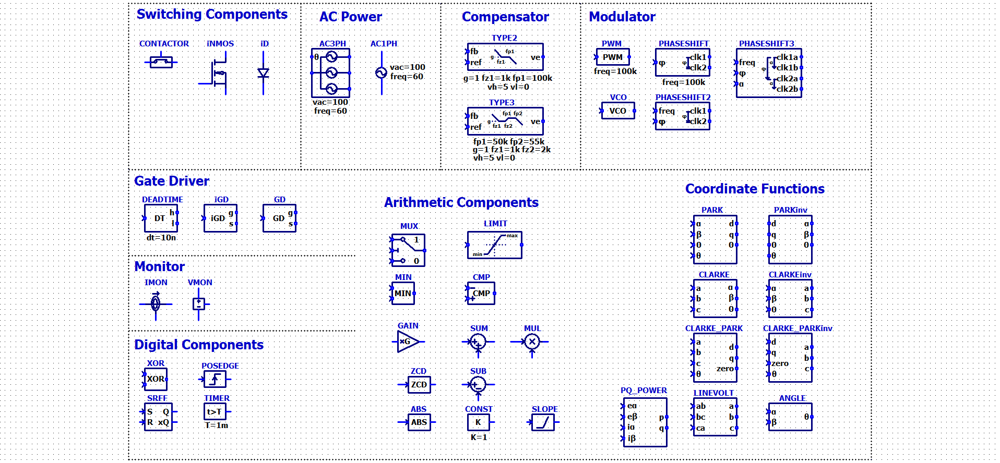

# LTspicePowerSim
A Simulink-like power electronics simulation environment built on LTspice, featuring ready-to-use circuit libraries and custom tools.

# Batch files
- install.bat: copies symbol/schematic files to LTspice folder.
- clean.bat: deletes copied files from LTspice folder.
- open_install_folder: opens LTspice folder

# Symbols

# Example Screen Shot

