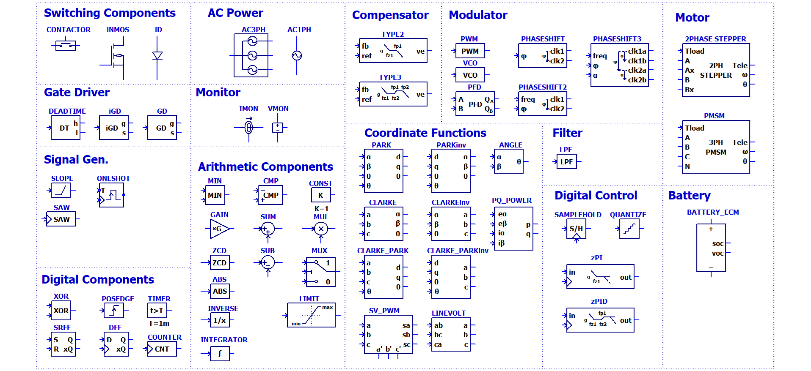
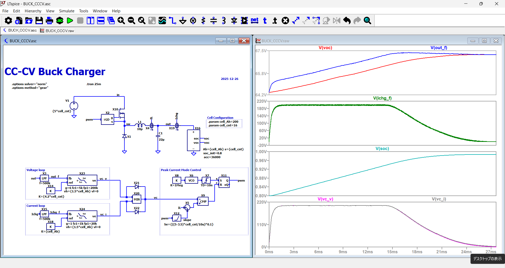
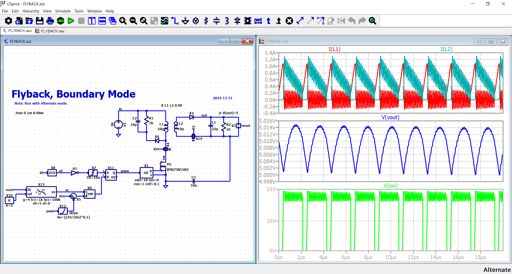
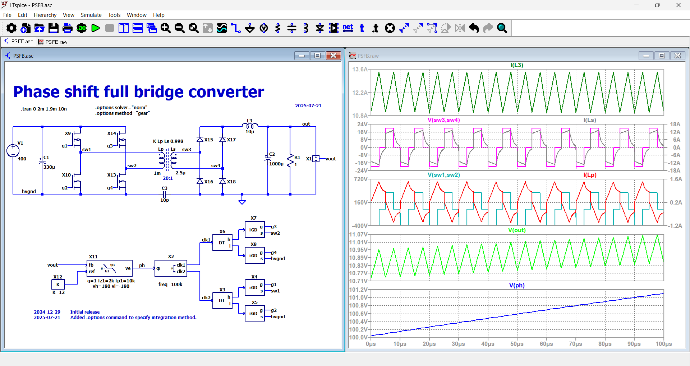
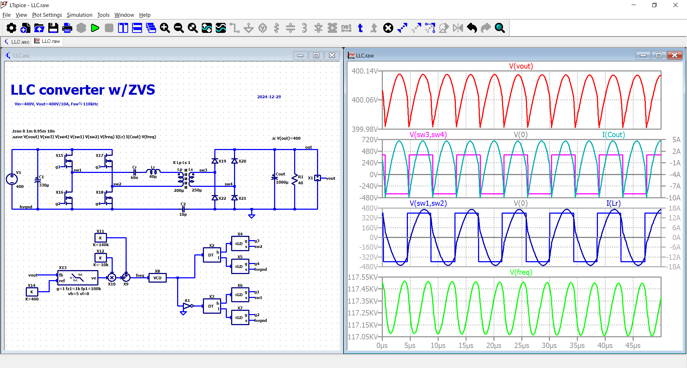
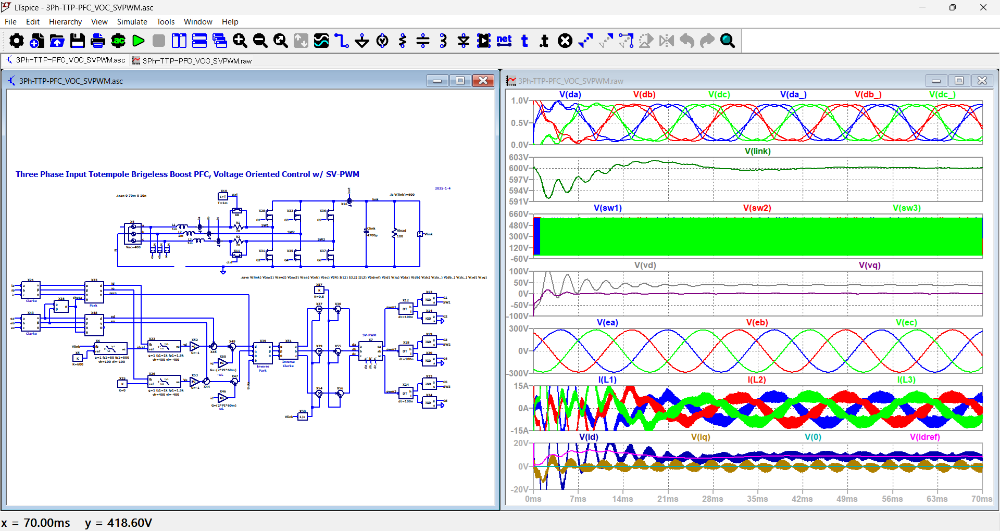
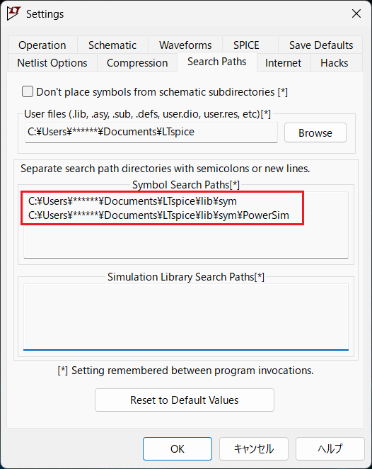

# LTspicePowerSim
LTspicePowerSim is a Simulink-like power electronics simulation environment built on LTspice. It provides a library of reusable circuit-level models together with extensive example circuits, making power electronics simulation easier and more accessible for engineers and researchers.


  ## Features✨
  - **Optimized Models for Convergence**: Includes circuit models specifically designed to enhance simulation convergence.
  - **Transparent Model Definitions**: All models are defined using LTspice schematic files (.asc), allowing users to view and edit the circuits directly as needed.
  - **Extensive example circuits**: A wide range of example circuits covering DC-DC converters, resonant converters, Totem-Pole PFC, motor drivers, battery charger, and digitally controlled power stages.


## Symbols🧩


## Example Screen Shot🖼️    

### Type-II Compensator (FRA)


### Peak Current Mode Buck Converter (Current-Mode Control)


### Peak Current Mode Boost Converter (Current-Mode Control)


### CCCV Buck Converter for Battery Charging (CC/CV control)



### Boundary Counduction Mode Flyback Converter (BCM / CrCM)



### Phase-Shift Full-Bridge Converter (PSFB with ZVS) 



### LLC Resonant Converter (Frequency Control)



###  Single-Phase Totem-Pole PFC (2-Phase Interleaved)


### Single-Phase 4-Level Totem-Pole PFC


### Three-Phase Totem-Pole PFC (VOC + SVPWM Control)


### Discrete-Time PID Controller (Z-Domain FRA)


### Discrete-Time Voltage-Mode Buck Converter (Digital Control)


### Two-Phase Stepper Motor Control using FOC


### Nerural-Network Controlled Buck Converter using [pytorch2ltspice](https://github.com/kosokno/pytorch2ltspice.git)


<br>

>**More Examples Available!**  
➡️ [**Go to Full Gallery 🖼️**](./Gallery.md)

<br>

## Getting Started💡

### Prerequisites

To use LTspicePowerSim, you need to have the following installed:

1. [LTspice](https://www.analog.com/en/design-center/design-tools-and-calculators/ltspice-simulator.html) – A high-performance SPICE simulation software.
2. Windows or macOS – The steps below cover installation for both operating systems.


### Model Installation (Windows)

- Copy the contents of the `sym\PowerSim` folder from this repository to:
    ```
   For LTspice 24.0.12 or earler
    C:\Users\<username>\AppData\Local\LTspice\lib\sym\PowerSim
   
   For LTspice 24.1.0 and up
    C:\Users\<username>\Documents\LTspice\lib\sym\PowerSim
    ```
- Replace `<username>` with your username.
- Or you can use following batch files in `bat` folders.

    | File Name              | Description                                                                 |
    |------------------------|-----------------------------------------------------------------------------|
    | `install.bat`          | Copies the model files into the LTspice folder.    |
    | `clean.bat`            | Removes all copied files from the LTspice folder.                          |
    | `open_install_folder.bat` | Opens the LTspice directory where the files are installed.               |


    > **Note:**  
    > Updated batch files to follow 24.1.0 onwards while keeping old ones in "old(-24.0.12)" folder.

- For LTspice 24.1.0 and up you also need to set the path for the PowerSim folder to be able to open the example files correctly. Just go to **Tools** > **Setting** and add the path as shown below.


### Model Installation (macOS)

- Copy the contents of the `sym\PowerSim` folder from this repository to:
    ```
    /Users/<username>/Library/Application　Support/LTspice/lib/
    ```
- Replace `<username>` with your username.


## Tips💡
- **Simulation Convergence**  
  - In most cases, simulations run stably with:  
    ```spice
    .options solver="norm"       <-- Other option: "alt"
    .options method="gear"       <-- Other option:"trap", "modtrap"
    ```  
    Try other option if simulation didn't converge.<br>
    The `.options solver` directive is available starting from **LTspice v24.1.0**. 
  - If convergence issues still occur, add:  
    ```spice
    .options debugtran
    ```  
    This helps identify which devices or nodes are causing difficulties in convergence.  
    The `.options debugtran` directive is also supported from **v24.1.0**.  
