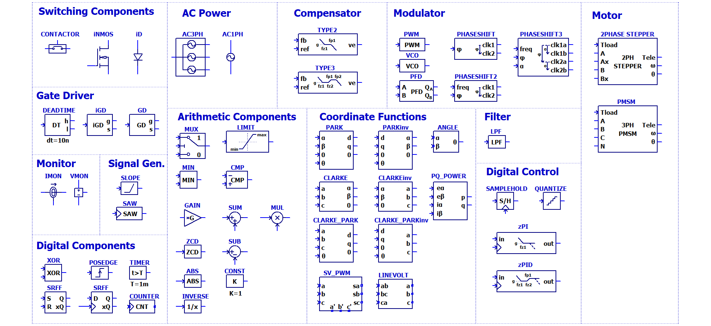
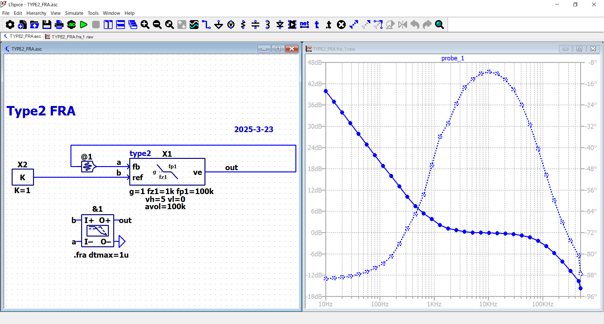

# LTspicePowerSim
LTspicePowerSim is a Simulink-like power electronics simulation environment built on LTspice. It provides a library of ready-to-use circuit designs and custom tools, making power electronics simulation easier and more accessible for engineers and researchers.

## Features
- **Optimized Models for Convergence**: Includes circuit models specifically designed to enhance simulation convergence.
- **Transparent Model Definitions**: All models are defined using LTspice schematic files (.asc), allowing users to view and edit the circuits directly as needed.
- **Extensive Example Circuits**: From basic converters such as Buck and Boost to advanced circuits like resonant converters and PFC (Power Factor Correction), the repository includes a wide range of example circuits.

## Symbols



## Example List


## Example Screen Shot
### Type2 Compensator



### Peak Current Control Buck Converter


### Peak Current Control Boost Converter


### Boundary Mode Flyback Converter


### Phase Shift Full Bridge Converter 


### LLC Converter 


### 2phase Interleaved Single phase input Totempole Bridgeless Boost PFC


### Three phase input Totempole Bridgeless Boost PFC with Table Based Direct Power Control


### Three phase input Totempole Bridgeless Boost PFC with Voltage Oriented Control and SVPWM


### Discrete PID Compensator


### Voltage mode buck with discrete control


### 2phase Stepper motor, micro step control


### Nerural Network Conrolled Voltage mode buck using [PyTorch2LTspice](https://github.com/kosokno/PyTorch2LTspice.git) (WIP)


## Getting Started

### Prerequisites

To use LTspicePowerSim, you need to have the following installed:

1. [LTspice](https://www.analog.com/en/design-center/design-tools-and-calculators/ltspice-simulator.html) – A high-performance SPICE simulation software.
2. Windows or macOS – The steps below cover installation for both operating systems.


### Model Installation (Windows)

- Copy the contents of the `sym\PowerSim` folder from this repository to:
    ```
   For LTspice 24.0.12 or earler
    C:\Users\<username>\AppData\Local\LTspice\lib\sym\PowerSim
   
   For LTspice 24.1.0 and up
    C:\Users\<username>\Documents\LTspice\lib\sym\PowerSim
    ```
- Replace `<username>` with your username.
- Or you can use following batch files in `bat` folders.

    | File Name              | Description                                                                 |
    |------------------------|-----------------------------------------------------------------------------|
    | `install.bat`          | Copies the model files into the LTspice folder.    |
    | `clean.bat`            | Removes all copied files from the LTspice folder.                          |
    | `open_install_folder.bat` | Opens the LTspice directory where the files are installed.               |


    > **Note:**  
    > Updated batch files to follow 24.1.0 onwards while keeping old ones in "old(-24.0.12)" folder.

- For LTspice 24.1.0 and up you also need to set the path for the PowerSim folder to be able to open the example files correctly. Just go to **Tools** > **Setting** and add the path as shown below.


### Model Installation (macOS)

- Copy the contents of the `sym\PowerSim` folder from this repository to:
    ```
    /Users/<username>/Library/Application　Support/LTspice/lib/
    ```
- Replace `<username>` with your username.


## Tips
- **Simulation Convergence**: In most cases, the simulation will work smoothly with the **Normal Solver**. However, if the simulation fails to converge, try switching to the **Alternate Solver**.  
  You can change the solver settings by navigating to **Tools > Settings**, then selecting the **SPICE > Engine > Solver** section in the control panel.
