# Gallery
<section style="display:flex;flex-wrap:wrap;gap:12px;">

  <a href="./TYPE2_FRA.png" style="flex:1 1 200px;max-width:200px;">
    
<strong>TYPE2_FRA</strong>
  
    
  </a>

  <a href="./TYPE3_FRA.png" style="flex:1 1 200px;max-width:200px;">
    
<strong>TYPE3_FRA</strong>
  
    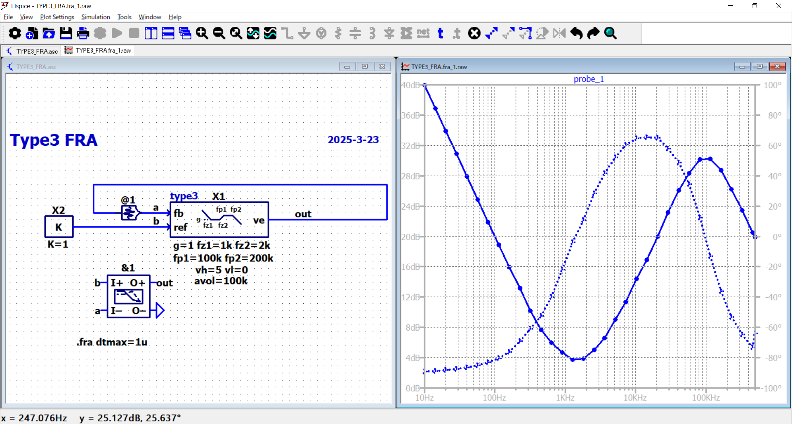
  </a>

  <a href="./zPI_FRA.png" style="flex:1 1 200px;max-width:200px;">
    
<strong>zPI_FRA</strong>
  
    
  </a>  

  <a href="./zPID_FRA.png" style="flex:1 1 200px;max-width:200px;">
    
<strong>zPID_FRA</strong>
  
    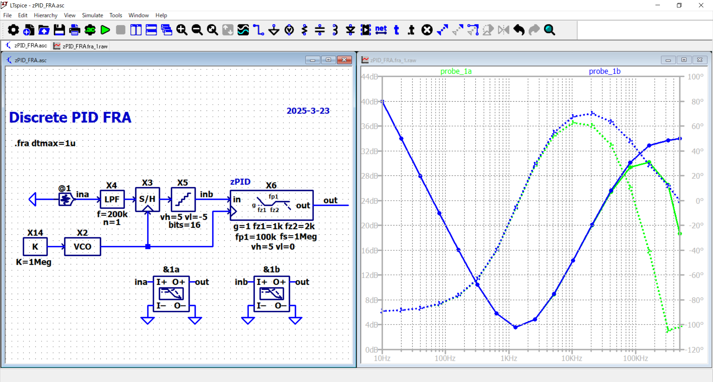
  </a>    

  <a href="./BUCK_VM.png" style="flex:1 1 200px;max-width:200px;">
    
<strong>BUCK_VM</strong>
  
    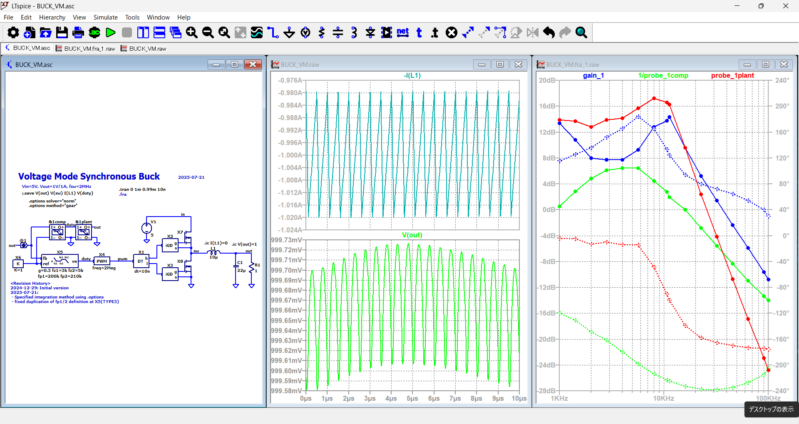
  </a>

  <a href="./BUCK_VM_DCM_plant.png" style="flex:1 1 200px;max-width:200px;">
    
<strong>BUCK_VM_DCM_plant</strong>
  
    
  </a>

  <a href="./BUCK_VM_CCM_plant.png" style="flex:1 1 200px;max-width:200px;">
    
<strong>BUCK_VM_CCM_plant</strong>
  
    
  </a>

  <a href="./BUCK_PCM.png" style="flex:1 1 200px;max-width:200px;">
    
<strong>BUCK_PCM</strong>
  
    
  </a>

  <a href="./BUCK_PCM_4ph.png" style="flex:1 1 200px;max-width:200px;">
    
<strong>BUCK_PCM_4ph</strong>
  
    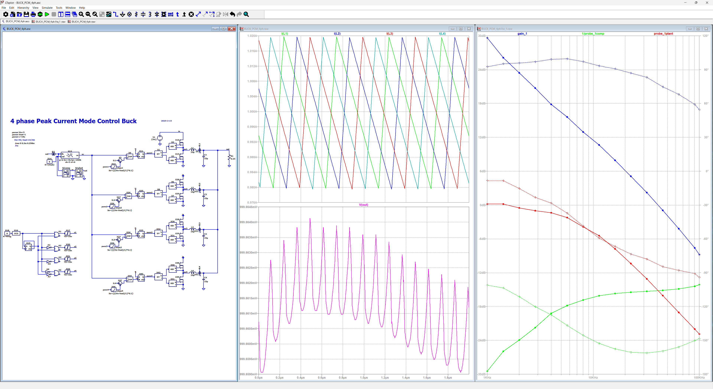
  </a>

  <a href="./BUCK_COT_ADP.png" style="flex:1 1 200px;max-width:200px;">
    
<strong>BUCK_COT_ADP</strong>
  
    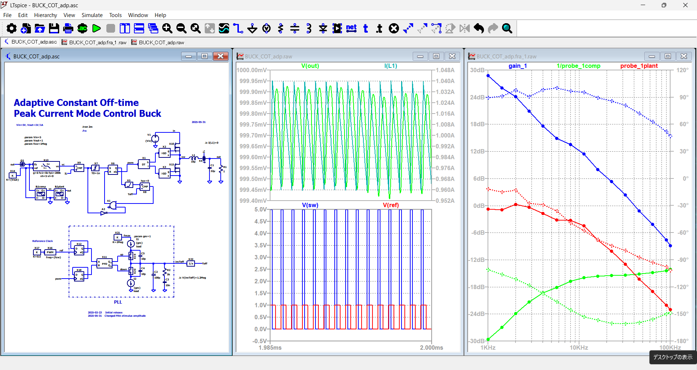
  </a>

  <a href="./BUCK_3LV.png" style="flex:1 1 200px;max-width:200px;">
    
<strong>BUCK_3LV</strong>
  
    
  </a>

  <a href="./BUCK_VM_discrete.png" style="flex:1 1 200px;max-width:200px;">
    
<strong>BUCK_VM_discrete</strong>
  
    
  </a>

  <a href="./BUCK_PCM_discrete.png" style="flex:1 1 200px;max-width:200px;">
    
<strong>BUCK_PCM_discrete</strong>
  
    
  </a>

  <a href="./BOOST_VM.png" style="flex:1 1 200px;max-width:200px;">
    
<strong>BOOST_VM</strong>
  
    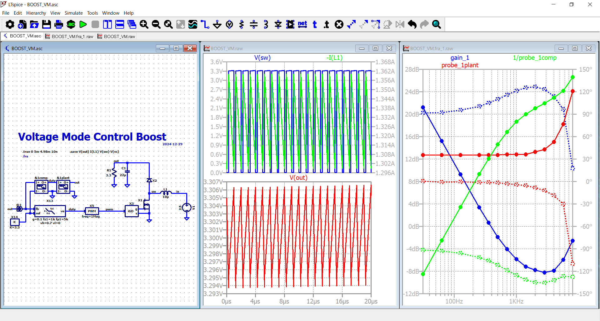
  </a>

  <a href="./BOOST_PCM.png" style="flex:1 1 200px;max-width:200px;">
    
<strong>BOOST_PCM</strong>
  
    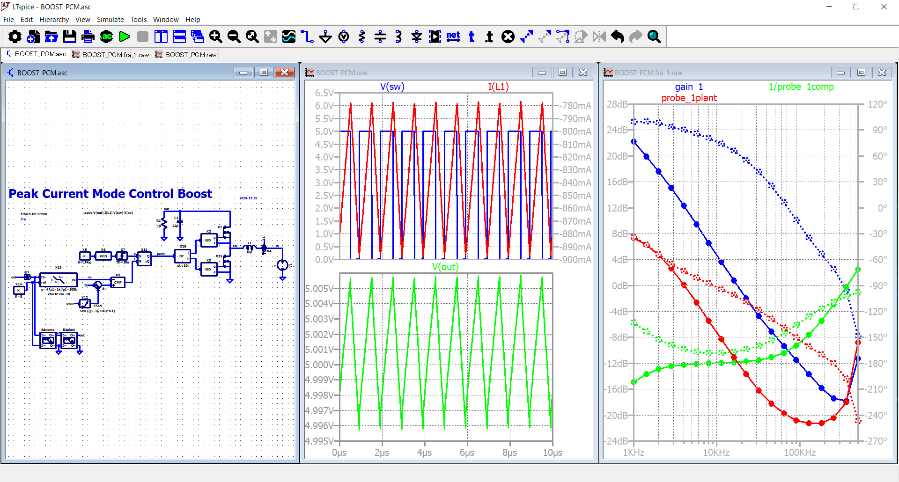
  </a>

  <a href="./BUCK-BOOST_VM.png" style="flex:1 1 200px;max-width:200px;">
    
<strong>BUCK-BOOST_VM</strong>
  
    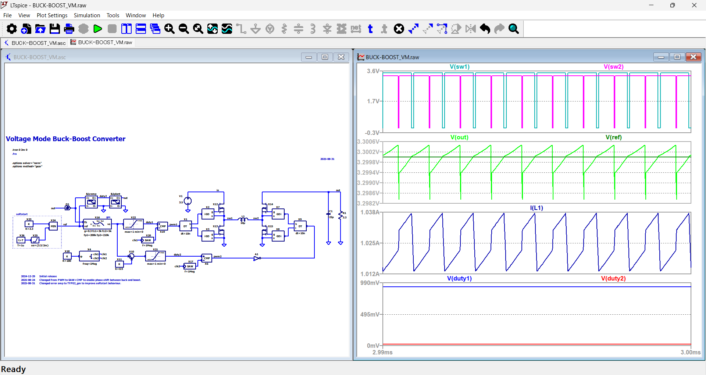
  </a>

  <a href="./SEPIC_PCM.png" style="flex:1 1 200px;max-width:200px;">
    
<strong>SEPIC_PCM</strong>
  
    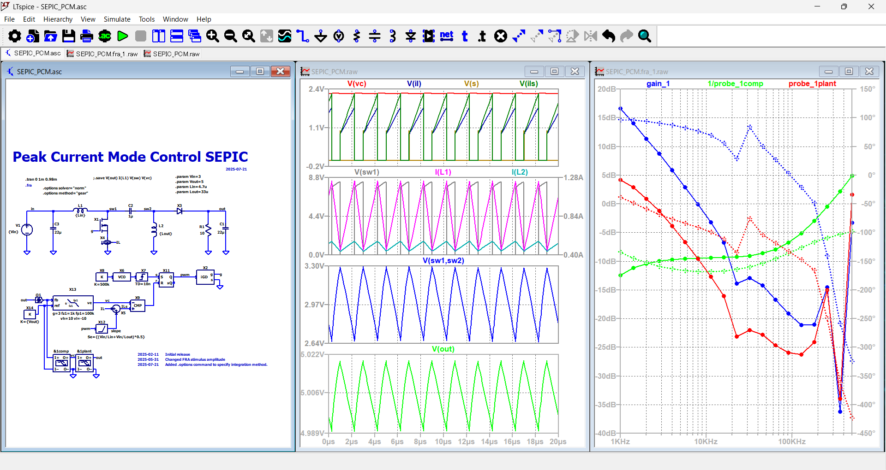
  </a>

  <a href="./FLYBACK.png" style="flex:1 1 200px;max-width:200px;">
    
<strong>FLYBACK</strong>
  
    
  </a>

  <a href="./PSFB2.png" style="flex:1 1 200px;max-width:200px;">
    
<strong>PSFB2</strong>
  
    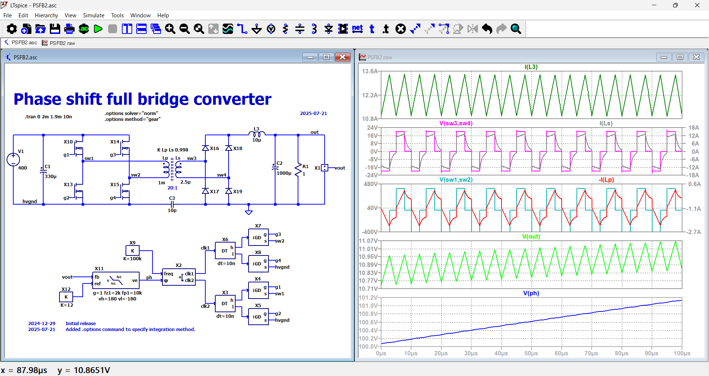
  </a>

  <a href="./LLC.png" style="flex:1 1 200px;max-width:200px;">
    
<strong>LLC</strong>
  
    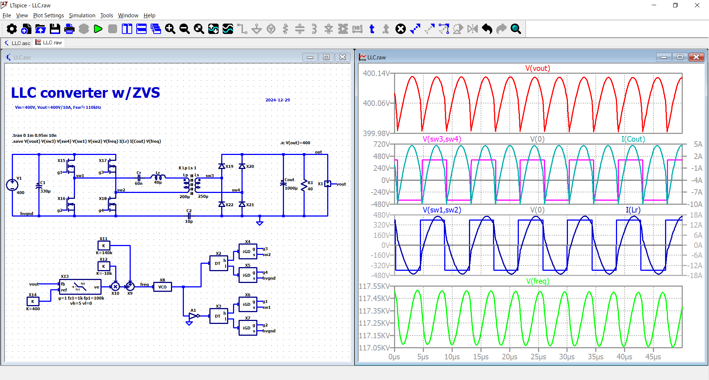
  </a>

  <a href="./DAB_Openloop.png" style="flex:1 1 200px;max-width:200px;">
    
<strong>DAB_Openloop</strong>
  
    
  </a>

  <a href="./CLLC_Openloop.png" style="flex:1 1 200px;max-width:200px;">
    
<strong>CLLC_Openloop</strong>
  
    
  </a>

  <a href="./1Ph-TTP-PFC.png" style="flex:1 1 200px;max-width:200px;">
    
<strong>1Ph-TTP-PFC</strong>
  
    
  </a>

  <a href="./1Ph-TTP-PFC_2ITLV.png" style="flex:1 1 200px;max-width:200px;">
    
<strong>1Ph-TTP-PFC_2ITLV</strong>
  
    
  </a>

  <a href="./1Ph-4LvTTP-PFC.png" style="flex:1 1 200px;max-width:200px;">
    
<strong>1Ph-4LvTTP-PFC</strong>
  
    
  </a>

  <a href="./3Ph-TTP-PFC_TB-DPC.png" style="flex:1 1 200px;max-width:200px;">
    
<strong>3Ph-TTP-PFC_TB-DPC</strong>
  
    
  </a>

  <a href="./3Ph-TTP-PFC_VOC.png" style="flex:1 1 200px;max-width:200px;">
    
<strong>3Ph-TTP-PFC_VOC</strong>
  
    
  </a>

  <a href="./3Ph-TTP-PFC_VOC_SVPWM.png" style="flex:1 1 200px;max-width:200px;">
    
<strong>3Ph-TTP-PFC_VOC_SVPWM</strong>
  
    
  </a>

  <a href="./CP_PLL.png" style="flex:1 1 200px;max-width:200px;">
    
<strong>CP_PLL</strong>
  
    
  </a>

  <a href="./STEP2PH_FSTEP.png" style="flex:1 1 200px;max-width:200px;">
    
<strong>STEP2PH_FSTEP</strong>
  
    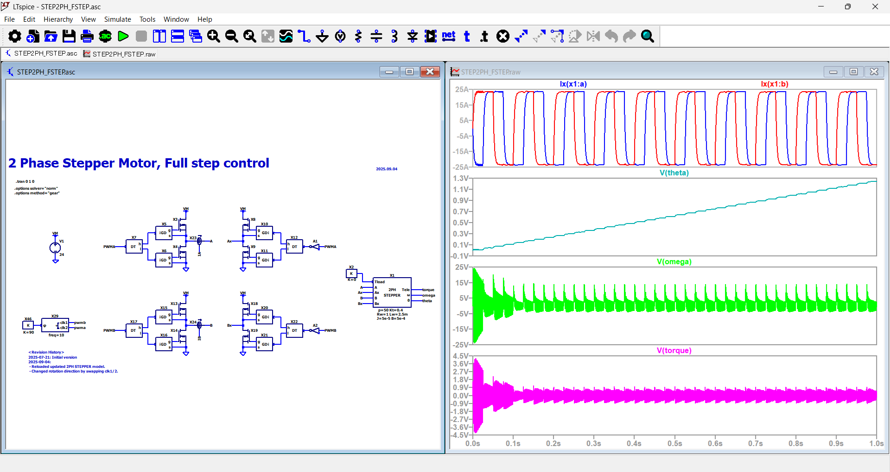
  </a>

  <a href="./STEP2PH_uSTEP.png" style="flex:1 1 200px;max-width:200px;">
    
<strong>STEP2PH_uSTEP</strong>
  
    
  </a>

  <a href="./STEP2PH_FOC.png" style="flex:1 1 200px;max-width:200px;">
    
<strong>STEP2PH_FOC</strong>
  
    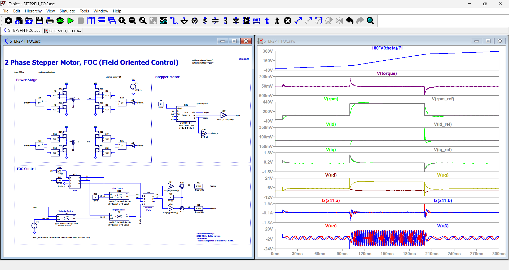
  </a>

  <a href="./PMSM_FOC.png" style="flex:1 1 200px;max-width:200px;">
    
<strong>PMSM_FOC</strong>
  
    
  </a>

</section>

# Component usage matrix
